# Mooncake编译流程

本目录下提供以下文件清单：

| 文件名                        | 解释            |
|----------------------------|---------------|
| `0001-cpu-bind.patch`      | 绑核功能适配补丁      |
| `0002-conda-install.patch` | Conda安装环境适配补丁 |
| `install.sh`               | 自动化编译脚本       |

自动化脚本支持以下可配置项：

| 选项                      | 默认值                               | 解释                                          |
|-------------------------|-----------------------------------|---------------------------------------------|
| `WORKSPACE`             | `/tmp/mooncake`                   | Mooncake的下载存放路径                             |
| `USE_CONDA`             | `true`                            | 使用Conda隔离环境，**注意默认为`true`**                 |
| `CONDA_ROOT`            | 空                                 | Conda的安装路径，例如`/root/anaconda3`，留空时会从环境中自动获取 |
| `CONDA_NAME`            | `mooncake`                        | 待使用的Conda环境名称，用来编译Mooncake，仅在使用Conda时配置有效   |
| `RDMA_CORE_INCLUDE`     | `/usr/include/infiniband`         | 适配专有环境的`rdma-core`头文件路径，仅在使用Conda时配置有效      |
| `RDMA_CORE_LIB`         | `/usr/lib64`                      | 适配专有环境的`rdma-core`库文件路径，仅在使用Conda时配置有效      |
| `RDMA_CORE_LIB_NAMES`   | `(libibverbs.so* librdmacm.so*)`  | 适配专有环境的`rdma-core`库文件名称，仅在使用Conda时配置有效      |

自动化脚本使用方式：

```bash
cd 3rdparty/Mooncake
# 完成配置项工作（可选）
bash install.sh
```

自动化脚本工作逻辑：

```mermaid
flowchart TD
    START["开始"] --> RDMA_DECIDE{"USE_CONDA=true 且<br/>RDMA_CORE_INCLUDE/LIB 均已配置<br/>且为有效目录"}
    RDMA_DECIDE -- 是 --> RDMA_LOCAL["USE_LOCAL_RDMA=true<br/>警告：将使用本地 RDMA 包"]
    RDMA_DECIDE -- 否 --> RDMA_VIA["RDMA_VIA_CONDA=true<br/>（USE_CONDA=false 时两者均跳过）<br/>路径缺失/无效时打印警告<br/>退化为 conda-forge 安装 rdma-core"]
    RDMA_LOCAL --> CFG["配置预览<br/>打印 WORKSPACE / USE_CONDA / CONDA_NAME<br/>RDMA 开关与 Patch 路径"]
    RDMA_VIA --> CFG

    CFG --> WS{"WORKSPACE 下<br/>已有 Mooncake 仓库"}
    WS -- 否 --> CLONE["git clone Mooncake"]
    WS -- 是 --> SKIP1["跳过 clone"]
    CLONE --> LF["统一工作区行尾为 LF<br/>检测到 CRLF 时重新检出"]
    SKIP1 --> LF

    LF --> CHKP{"Patch 文件<br/>均存在"}
    CHKP -- 否 --> ERR["报错退出"]
    CHKP -- 是 --> RESET["git checkout .<br/>清空未提交内容"]
    RESET --> BASE{"HEAD == 基线 commit<br/>MOONCAKE_BASE_COMMIT"}
    BASE -- 否 --> CO["git checkout 基线 commit"]
    BASE -- 是 --> SKIP2["跳过切换"]
    CO --> A1["git apply 0001-cpu-bind.patch"]
    SKIP2 --> A1

    A1 --> CONDACHK{"USE_CONDA == true"}
    CONDACHK -- 是 --> A2["git apply 0002-conda-install.patch"]
    CONDACHK -- 否 --> SKIP3["跳过 0002-conda-install.patch"]

    SKIP3 --> DEPS_SYS["安装依赖<br/>dependencies.sh<br/>系统包管理器（需 root）"]
    A2 --> CONDA_ENV["激活已有 Conda 环境<br/>或新建环境"]
    CONDA_ENV --> DEPS_CONDA["安装依赖<br/>dependencies.sh<br/>Conda 环境内执行"]

    DEPS_SYS --> CHK1{"USE_LOCAL_RDMA"}
    DEPS_CONDA --> CHK1
    CHK1 -- 是 --> RDMA_INC["拷贝头文件<br/>RDMA_CORE_INCLUDE → $CONDA_PREFIX/include/"]
    RDMA_INC --> RDMA_LIB["按 RDMA_CORE_LIB_NAMES<br/>拷贝库文件 → $CONDA_PREFIX/lib/<br/>无匹配文件时报错退出"]
    CHK1 -- 否 --> SKIP4["跳过本地 RDMA 拷贝"]
    RDMA_LIB --> CHK2{"RDMA_VIA_CONDA"}
    SKIP4 --> CHK2
    CHK2 -- 是 --> RDMA_INSTALL["conda install -c conda-forge rdma-core"]
    CHK2 -- 否 --> SKIP5["跳过 rdma-core 安装"]
    RDMA_INSTALL --> CMAKE["cmake 配置<br/>Conda 模式追加 CMAKE_INSTALL_PREFIX"]
    SKIP5 --> CMAKE
    CMAKE --> MAKE["make 编译<br/>-j$(nproc)"]
    MAKE --> INSTALL["make install"]
    INSTALL --> DONE["完成<br/>Mooncake 安装成功<br/>打印安装位置"]
```


