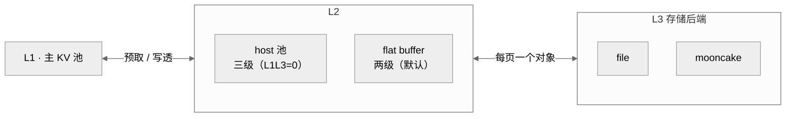

# Kunpeng 多级 KV 缓存（HiCache）使用指南

面向 920F（Kunpeng CPU）路径的 HiCache 配置说明：怎么打开、各层级有哪些环境变量、每个变量控制什么、`file` 与 `mooncake` 两个 L3 后端分别需要什么。

---

## 1. 概述

HiCache 把 KV cache 分成若干层级，越靠后容量越大、延迟越高：

| 层级 | 位置 | 说明 |
|---|---|---|
| **L1** | 设备侧主 KV 池（DDR） | 原来的主 KV cache 池，占满后按淘汰策略回收 |
| **L2** | 额外的 DDR 池（host pool） | **仅三级模式有**；大小由 `RATIO`/`SIZE` 决定 |
| **L3** | 外部存储后端 | 所有 prefill 节点共享；由 `KUNPENG_HICACHE_BACKEND` 选择 `file` 或 `mooncake` |

整体结构（仅 `prefill` / `native` 参与，`decode` 不参与）：



由 `KUNPENG_HICACHE_L1L3` 选择两种形态：

- **两级模式（默认）**：只有 **L1 + L3**，整层去掉 L2 host 池。
  省掉一份 DDR（三级模式默认 `RATIO=1.0`，等于再占一份 KV 池的 DDR）；代价是 L1↔L3 之间多一块固定大小的**扁平中转缓冲（flat buffer）**做数据搬运。
- **三级模式**：保留 **L1 + L2 + L3**。

生效角色：**只有 `prefill` 和 `native`**（`decode` 不参与）。
页粒度：`--page-size 64`，即 **1 页 = 64 token**；L3 中 **1 个对象 = 1 页**，key 是该页的 hash。

---

## 2. 快速开始

**只需打开总开关即可**（后端与层级形态都有合理默认）：

```bash
export ENABLE_KUNPENG_HICACHE=1
```

两种后端的配置方式：

**mooncake（默认，无需额外配置）**

```bash
if [[ "$1" == "prefill" || "$1" == "native" ]]; then
    export ENABLE_KUNPENG_HICACHE=1
fi
```

**file（改后端 + 给一个共享目录）**

```bash
if [[ "$1" == "prefill" || "$1" == "native" ]]; then
    export ENABLE_KUNPENG_HICACHE=1
    export KUNPENG_HICACHE_BACKEND=file
    export KUNPENG_HICACHE_L3_DIR="/home/share/xxx/hicache_pool"
fi
```

- `./launch.sh all` 会**自动**检测「`ENABLE_KUNPENG_HICACHE=1` + `BACKEND=mooncake`」，一并拉起/停止 mooncake 的 master 与 store，无需手动启动。
- 注意：`ENABLE_KUNPENG_HICACHE` 默认 `0`，**总开关必须显式打开**；「有默认值」指的是后端、层级形态这些子参数。

---

## 3. 环境变量（按层级分类）

```
scripts/cpu_kunpeng/
├── .user_env.sh                     # 个人/部署配置（优先级最高）
└── runtime/
    ├── env_base.sh                  # 公共默认 + 加载 .user_env.sh
    ├── env_prefill.sh               # prefill/native 默认（HiCache 公共变量）
    ├── env_mooncake.sh              # mooncake master 角色
    └── env_store.sh                 # mooncake store 角色
```

> 所有默认值都写成 `${VAR:-default}` 形式；在 `.user_env.sh` 里 `export` 同名变量即可覆盖（`KUNPENG_HICACHE_*`、`MOONCAKE_*` 是脚本层与后端层变量，引擎层的 `SGLANG_KUNPENG_HICACHE_*` 由脚本自动导出，一般不用手写）。

### 3.0 总开关与全局调试

| 变量 | 默认 | 类型 | 作用 |
|---|---|---|---|
| `ENABLE_KUNPENG_HICACHE` | `0` | 开关 | **总开关**。`1` 才给 prefill/native 加 `--enable-hierarchical-cache` |
| `SGLANG_HICACHE_DEBUG` | `0` | 调试 | `1` 打开逐次搬运的 `[hicache] ...` 详细日志 |

### 3.1 L1（设备侧主 KV 池）

无需配置——它就是原来的主 KV 池。HiCache 只在其上做读/写，不改变其容量与淘汰策略。

> 引擎会自动按 rank 设置 `SGLANG_KUNPENG_HICACHE_CPU_OFFSET`（HiCache 后台线程的 CPU 亲和偏移），不需要手工配置。

### 3.2 L2（host pool / flat buffer）

先用形态开关决定 L2 是否存在：

| 变量 | 默认 | 类型 | 作用 |
|---|---|---|---|
| `KUNPENG_HICACHE_L1L3` | `1` | 开关 | `1`=两级（L1+L3，**没有 L2**）；`0`=三级（L1+L2+L3） |

#### 3.2.1 三级模式专有（`KUNPENG_HICACHE_L1L3=0`）——L2 是真正的缓存层

| 变量 | 默认 | 类型 | 作用 |
|---|---|---|---|
| `KUNPENG_HICACHE_RATIO` | `1.0` | 大小 | L2 池 = `RATIO ×` L1 主 KV 池大小 |
| `KUNPENG_HICACHE_SIZE` | 空 | 大小 | 直接指定 L2 池大小（GB），**优先于 `RATIO`** |

> 节点 DDR 开销 = **每节点 rank 数 × 每 token 大小 × max_total_tokens × RATIO**（每个 rank 各一份）。
> 若分配后节点剩余可用内存 < 10 GB，host pool 会**拒绝启动**。

#### 3.2.2 两级模式专有（`KUNPENG_HICACHE_L1L3=1`）——L2 换成 flat buffer

两级模式没有 L2 池，只剩一块固定大小的 flat buffer（不 alloc/free、不淘汰、不绑树，仅作 DMA 中转）：

| 变量 | 默认 | 类型 | 作用 |
|---|---|---|---|
| `KUNPENG_HICACHE_IO_BATCH_PAGES` | `128` | 大小 | flat 缓冲能装多少页，**同时**决定单次 L3 批次的最大页数与缓冲大小。调小 = 省 DDR、但 L3 往返更频繁 |
| `SGLANG_KUNPENG_HICACHE_L1L3_PREFETCH_RATIO` | `0.25` | 限流 | 在途预取 token 最多占 L1 池的比例，超过即限流，避免预取挤爆 L1 |
| `SGLANG_KUNPENG_HICACHE_L3_INDEX_RATIO` | `4.0` | 上界 | 「只剩 L3 有副本」的树上界（这类节点不占内存、只占元数据），上限 = `L1 池 × 该比例` |

> 单页字节数 = `层数 × 64 × kv_dim × 2B`；例如 61 层 MLA、`kv_dim=576` 时约 **4.29 MiB/页**。
> flat 缓冲每个 TP rank 各注册一份，内存开销随 TP 数线性增长。
>
> 两级模式的约束：只支持 **MLA** 池（MHA/NSA 直接 `NotImplementedError`）；写策略不支持 `write_back`。
>
> 上面 `SGLANG_KUNPENG_HICACHE_*` 由 `server.sh` 依据脚本变量自动导出，一般不用手写。

### 3.3 L3（存储后端）

#### 3.3.1 公共（两个后端都适用）

| 变量 | 默认 | 类型 | 作用 |
|---|---|---|---|
| `KUNPENG_HICACHE_BACKEND` | `mooncake` | 开关 | 选 L3 后端：`file` / `mooncake` |
| `KUNPENG_HICACHE_WRITE_POLICY` | `write_through` | 行为 | **写透策略**：`write_through` 首次插入即写 L3；`write_through_selective` 命中 2 次后才写。`write_back` 在两级模式**不支持**（会报错） |
| `KUNPENG_HICACHE_PREFETCH_POLICY` | `wait_complete` | 行为 | L3→L1 预取策略：`wait_complete` 阻塞到整个前缀加载完（不重算）；`timeout` / `best_effort` 提前放弃，可能部分重算 |

#### 3.3.2 后端 A：`file`

每页一个文件，放在所有 prefill 节点共享的目录里。

| 变量 | 默认 | 类型 | 作用 |
|---|---|---|---|
| `KUNPENG_HICACHE_L3_DIR` | 空 | 路径 | 页文件目录（需被所有 prefill 节点共享）。**留空 = L3 关闭**（`server.sh` 会打印 `L3 disabled, running L1<->L2 only`） |

`server.sh` 会 `mkdir -p` 该目录，并导出 `SGLANG_HICACHE_FILE_BACKEND_STORAGE_DIR`。
适用：单机/小规模验证、无 RDMA 环境。缺点：无淘汰、无容量上限、依赖共享文件系统。

#### 3.3.3 后端 B：`mooncake`

分布式共享内存 store，L3 的 KV 实际存在 store 服务的 segment 里。涉及**四个视角的角色**：

| 角色 | 进程 | 说明 |
|---|---|---|
| **共享** | —— | 所有角色都要知道的地址/设备信息 |
| **master** | `mooncake_master`（原生二进制） | 全局 segment 分配、对象元数据、淘汰决策 |
| **store** | `python -m mooncake.mooncake_store_service` | 真正持有 L3 共享 segment 的服务（SGLang 节点默认不贡献内存） |
| **客户端** | prefill / native 的 server 进程 | 通过 RDMA 读写 L3 |

**① 共享（`env_base.sh`，所有角色）**

| 变量 | 默认 | 作用 |
|---|---|---|
| `MOONCAKE_MASTER_NODE` | `$ROUTER_IP` | master 所在节点，需在 prefill/decode 节点集之外且所有角色可见 |
| `MOONCAKE_MASTER_PORT` | `50061` | master 的 **RPC** 端口（客户端连这个） |
| `MOONCAKE_MASTER` | `$MOONCAKE_MASTER_NODE:$MOONCAKE_MASTER_PORT` | 上面两项拼成的连接串 |
| `MOONCAKE_DEVICE` | `roceroh0,roceroh3,roceroh4,roceroh7` | 用于传输的 RDMA 设备列表（**硬件相关，需按本机实际调整**） |
| `MOONCAKE_LOCAL_HOSTNAME` | 由 `enp26s0f0` 的 IP 自动解析 | 本机地址，master 用它寻址客户端 |

**② master 角色（`env_mooncake.sh`）**

| 变量 | 默认 | 作用 |
|---|---|---|
| `MOONCAKE_MASTER_BIN` | `$CONDA_ENV_PATH/bin/mooncake_master` | master 二进制路径（脚本校验「存在 + 可执行」）。**必须与客户端同源**，否则 warmup 报 `invalid rpc arg` |
| `MOONCAKE_METADATA_PORT` | `8080` | master 内置 **HTTP metadata server** 端口；**与 RPC 端口不同**，两者不能冲突 |
| `MOONCAKE_EVICTION_WATERMARK` | `0.9` | 全局 segment 使用率超过此比例即开始淘汰对象 |
| `MOONCAKE_MASTER_READY_TIMEOUT` | `300` | `launch.sh mooncake` 等待 master 端口的秒数（慢启动只告警不失败） |

**③ store 角色（`env_store.sh`）**

| 变量 | 默认 | 作用 |
|---|---|---|
| `MOONCAKE_STORE_NODE` | `$MOONCAKE_MASTER_NODE` | store 服务所在节点 |
| `MOONCAKE_STORE_PORT` | `8081` | store 服务监听端口 |
| `MOONCAKE_STORE_SEGMENT_SIZE` | `64gb` | **L3 总容量**（这一份就是全部 L3 空间） |
| `MOONCAKE_GLOBAL_SEGMENT_SIZE` | = `MOONCAKE_STORE_SEGMENT_SIZE` | 贡献给全局池的内存大小 |
| `MOONCAKE_LOCAL_HOSTNAME` | `$MOONCAKE_STORE_NODE` | store 侧主机名 |
| `MOONCAKE_LOCAL_BUFFER_SIZE` | `0` | store 只贡献内存、不发起请求，本地 buffer 为 0 |
| `MOONCAKE_PROTOCOL` | `rdma` | 传输协议（`rdma` / `tcp`） |
| `MOONCAKE_TE_META_DATA_SERVER` | `P2PHANDSHAKE` | 传输引擎 metadata server；无独立 metadata 服务时用 `P2PHANDSHAKE` |
| `MOONCAKE_STORE_READY_TIMEOUT` | `300` | `launch.sh store` 等待端口的秒数 |

**④ 客户端侧（`env_prefill.sh`，prefill / native）**

| 变量 | 默认 | 作用 |
|---|---|---|
| `MOONCAKE_PROTOCOL` | `rdma` | 同 store，客户端也要指定 |
| `MOONCAKE_TE_META_DATA_SERVER` | `P2PHANDSHAKE` | 同 store |
| `MOONCAKE_GLOBAL_SEGMENT_SIZE` | `0` | **SGLang 节点不贡献内存**，L3 全在 store 进程。设为非 0 则节点自贡献、可省掉独立 store |

**⑤ 高级：JSON 配置文件（可选）**

| 变量 | 默认 | 作用 |
|---|---|---|
| `SGLANG_HICACHE_MOONCAKE_CONFIG_PATH` | 未设置 | 指向 JSON 文件；设置后按文件读取（**优先级高于环境变量**） |
| `SGLANG_HICACHE_MOONCAKE_REUSE_TE` | `True` | 复用传输引擎实例 |

解析优先级：`extra_config`（代码传入）> JSON 文件 > 环境变量。
另有引擎侧默认值，一般不用改：`MOONCAKE_MASTER_METRICS_PORT`（`9003`）、`MOONCAKE_CHECK_SERVER`（`False`）、`MOONCAKE_STANDALONE_STORAGE`（`False`）、`MOONCAKE_CLIENT`（未设置）。

---

## 4. 常见问题

| 现象 | 原因 / 处理 |
|---|---|
| 日志出现 `L3 disabled, running L1<->L2 only` | `KUNPENG_HICACHE_BACKEND=file` 且 `KUNPENG_HICACHE_L3_DIR` 为空 → 填目录 |
| warmup 报 `invalid rpc arg` / `RPC_FAIL` | master 与客户端 mooncake 版本不一致（如一个来自源码构建、一个来自 wheel）。确认 `MOONCAKE_MASTER_BIN` 与客户端同源 |
| 节点 DDR 被吃满 | 三级模式下 `RATIO`/`SIZE` 过大；改用两级模式 `KUNPENG_HICACHE_L1L3=1`（默认） |
| `--hicache-ratio` 看起来没生效 | 两级模式下该参数**不传**，属预期；要调 L2 需先 `KUNPENG_HICACHE_L1L3=0` |
| 启动时报 `NotImplementedError: ... MLA pools only` | 两级模式只支持 MLA 池 |
| 启动时报 `... supports write_through / write_through_selective only` | 两级模式不支持 `write_back` |
| 最后一页始终不命中（如 511/512） | 属预期：EAGLE bigram 视图下 `N` 个 token 只有 `N-1` 个 bigram，且 L3 只存整页，尾部残页不落盘 |